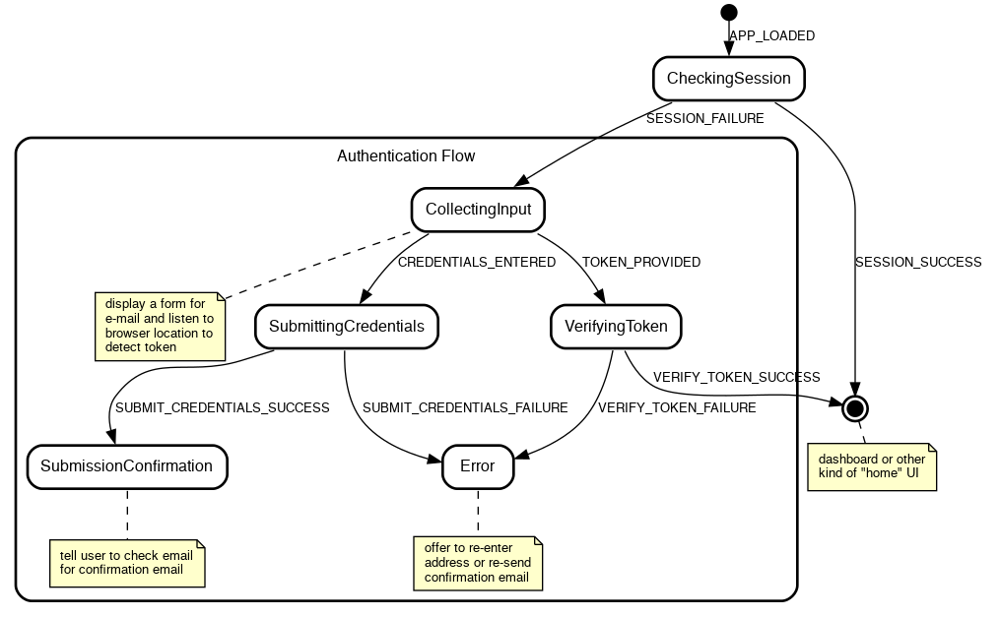

# Writing a robust, reusable login flow with redux‑agent and state charts

_Work in progress, 90% finished, missing sections point to the relevant parts of the repository for the project._

Web application login is a complex puzzle: many possible error conditions, flows that stop on one page and resume on another (think email verification or OAuth), invitation codes, communication consent, ... and all at a time when the user is least motivated to keep going if anything goes wrong.

We'll see how to implement a login flow using redux-agent with some help from state charts. We want a result that is robust and understandable, and a process to achieve that through method, not effort. State charts aren't a requirement for using redux-agent, the two just happen to work beautifully together.

Instead of the textbook username/password example, we'll make things more interesting by allowing the user to enter just an email and receive a one-time login link (what is sometimes called the "magic link" auth strategy). This will make the flow more complex but will remove friction for the user (one less password to come up with) and work for back end engineers (no passwords to store).

Thanks to redux-agent's model, we'll be able to place the logic in a self-contained reducer that: 

- can be reused elsewhere with minimal modification
- shows clearly what state leads to which effects
- is independent of any particular UI framework

Let's get started!

## The design

In a perfect world, only this would happen:

1. app loads
2. user enters email and clicks "send me a login link"
3. app tells user that email is on its way 
4. user opens inbox, finds email, and clicks on the link containing the token
5. app loads again
6. app verifies token
7. app displays the main interface (home, dashboard, ...)

Meanwhile, in the real world, the verification token may have expired and we should offer to resend the confirmation email; the server may be unreachable and we should notify the user; the user may be already logged in and we should show the main UI immediately... 

Here's a more realistic view of the possible flows, represented as a "state chart". In it, a box represents a state that the application may be in; I'll call it a _control state_ to avoid confusion with _Redux state_. (To name such states, I like to ask "What's the application doing at this point?") A label represents an input that the application will accept in a given state (a user action, a server response, ...).



I won't go into details here about state charts, I'll just point out some of their benefits and encourage you to look more into them (pointers provided at the end):

- They make the implicit state machines your code already contains (in the form of `isLoading`, `isError`, etc.) explicit and thus easier to reason about
- They represent complex processes in a digestible form for both developers and designers
- They make it obvious when some case isn't covered
- They make implementation systematic and refreshingly _boring_
- With a little runtime support, they eliminate an entire class of bugs (the one caused by input coming in at invalid times such as double submits)

## The implementation

The finished project is available on GitHub, clone it to follow along or play with it. It contains a basic React UI which we'll (mostly) not discuss in the article because `redux-agent` is independent of any particular UI framework.

```sh
$ git clone https://github.com/bard/redux-agent-login-tutorial.git
$ cd redux-agent-login-tutorial
$ npm install
$ npm start
```

### The state object

```js
{
  // A name that answers the question, "What's the 
  // application doing right now?"
  //
  // E.g.: 'Starting', 'CheckingSession', 'CollectingInput',
  // 'SubmittingCredentials', ...
  
  controlState: 'Starting',
  
  // Some data specific to the 'Error' control state
  
  error: {
    // Error information, if any, to display to the user
    message: null,
    
    // State to go back to when the RETRY action is received
    retryState: null,
    
    // Optional task to re-run when retrying
    retryTask: null
  }
}
```

### The reducer

Let's start by enumerating the inputs ("actions" in Redux parlance) the system will respond to. These is essentially a copy/paste of the labels in the diagram we've seen above:

`reducer.js`:

```js
--8<--
docs/guides/example2.js
--8<--
```

### Checking if a session exists

At the beginning, when the application is loading, we expect to receive an `APP_LOADED` action. How that action is dispatched is up to you and your UI framework of choice. In the React-based example app it is:

`App.jsx`:

```jsx
import React, { useEffect } from 'react'
import { useDispatch } from 'react-redux'
import { APP_LOADED } from './reducers/login'

const App = () => {
  const dispatch = useDispatch()
  const dispatch = useDispatch()
  // Passing an empty dependency array to only run effect at mount time
  useEffect(() => { dispatch({ type: APP_LOADED }) }, [])
  
  return (<div>...</div>)
}

export default App
```

Once the application has loaded, we want to check if we have a session already, because if we do, we can skip the login flow entirely. We'll do that by querying the (mocked) REST API for a resource that is only available to logged-in users, e.g. `/account`:

```js
case APP_LOADED: {
  return addTask(state, {
    type: 'http',
    method: 'get',
    url: '/account',
    actions: {
      success: SESSION_SUCCESS,
      failure: SESSION_FAILURE
    }
  })
}
```

We can make that easier on the eyes by taking a page out of Redux conventions and encapsulating the task in a task creator, as we would do with actions and action creators:

```js
const checkSession = () => ({
  type: 'http',
  method: 'get',
  url: '/account',
  actions: {
    success: SESSION_SUCCESS,
    failure: SESSION_FAILURE
  }
})

const reducer = (state, action) => {
  switch(action.type) {
    case APP_LOADED: {
      return addTask(state, checkSession())
    }
```

We'll also keep track of what control state we're in, for two purposes:

1. we can use that information in the UI (e.g. show a loader, change screen, disable input)
2. we can make sure that we don't handle actions out of their intended context (such as when a user clicks a form "submit" button a second time)

Tracking the control state is trivial:

```diff
  case APP_LOADED: {
-   return addTask(state, checkSession())
+   const newState = addTask(state, checkSession())
+
+   return { ...newState, controlState: 'CheckingSession' }
  }
```

And to handle `APP_LOADED` only if we're in the `Starting` control state:

```diff
  case APP_LOADED: {
+   if (state.controlState !== 'Starting') return state
+
    const newState = addTask(state, checkSession())
```

What we end up with:

```js
case APP_LOADED: {
  if (state.controlState !== 'Starting') return state

  const newState = addTask(state, checkSession())

  return { ...newState, controlState: 'CheckingSession' }
}
```

Next we'll handle the possible outcomes of the `GET /account` HTTP task: success (we have a session) or failure (we either don't have a session or can't find out due to network or server error).

In case of success, we just want to display the main UI, so we set the appropriate control state and let `react-redux` or equivalent bring up the correct UI:

```js
case SESSION_SUCCESS: {
  if (state.controlState !== 'CheckingSession') return state
  
  return { ...state, controlState: 'Home' }
}
```

The failure case needs a little more attention. If the HTTP request failed with a 401 code, then we know we're not authenticated and must show the login form. If it failed with any other error, we want to display the error and give the user a chance of retrying.

(Note that the action payload carries the response body and the action meta carries the response status code.)

```js
case SESSION_FAILURE: {
  if (state.controlState !== 'CheckingSession') return state

  if (action.meta.status === 401) {
    return { 
      ...state, 
      controlState: 'CollectingInput'
    }
  } else {
    return { 
      ...state, 
      controlState: 'Error',
      error: { 
        message: action.payload,
        retryState: 'CheckingSession',
        retryTask: checkSession()
      }
    }
  }
}
```

Our reducer so far:

```js
const reducer = (state, action) => {
  switch (action.type) {
    case APP_LOADED: {
      if (state.controlState !== 'Starting') return state
    
      const newState = addTask(state, checkSession())
    
      return { ...newState, controlState: 'CheckingSession' }
    }
    
    case SESSION_SUCCESS: {
      if (state.controlState !== 'CheckingSession') return state
      
      return { ...state, controlState: 'Home' }
    }

    case SESSION_FAILURE: {
      if (state.controlState !== 'CheckingSession') return state
    
      if (action.meta.status === 401) {
        return { 
          ...state, 
          controlState: 'CollectingInput'
        }
      } else {
        return { 
          ...state, 
          controlState: 'Error',
          error: { 
            message: action.payload,
            retryState: 'CheckingSession',
            retryTask: checkSession()
          }
        }
      }
    }
  }
}
```

### Collecting input

If no session is present and we find ourselves in the `CollectingInput` state, it may be because the user accessed the app for the first time, or it may be because the user clicked on an email verification link resulting from a previous login attempt, thus in the `CollectingInput` state the UI will need to do two things:

1. display the login form
2. check the location bar for an email verification token

If the token is there, the UI will dispatch a `TOKEN_PROVIDED` action; if not, it will wait for user input and then dispatch a `CREDENTIALS_ENTERED` action. (See the example app for a way of doing that with React.)

Both actions imply an HTTP task, either to submit the request for a login link, or to verify the token. 

Submitting the request for a login link:

```js
const submitCredentials = (email) => ({
  type: 'http',
  method: 'post',
  url: '/auth/email/requests',
  body: { email },
  actions: {
    success: SUBMIT_CREDENTIALS_SUCCESS,
    failure: SUBMIT_CREDENTIALS_FAILURE,
  }
}) 

const reducer = (state, action) => {
  switch (action.type) {
    case CREDENTIALS_ENTERED: {
      if (state.controlState !== 'CollectingInput') return state
      
      const { email } = action.payload
      const newState = addTask(state, submitCredentials(email))

      return { ...newState, controlState: 'SubmittingCredentials' }
    }
```

Verifying the token:

```js
const verifyToken = (token) => ({
  type: 'http',
  method: 'post',
  url: '/auth/email/verifications',
  body: { token },
  actions: {
    success: VERIFY_TOKEN_SUCCESS,
    failure: VERIFY_TOKEN_FAILURE,
  }
}) 

const reducer = (state, action) => {
  switch (action.type) {
    case TOKEN_PROVIDED: {
      if (state.controlState !== 'CollectingInput') return state
      
      const { token } = action.payload
      const newState = addTask(state, verifyToken(token))

      return { ...newState, controlState: 'VerifyingToken' }
    }
```

### Notice a pattern?

You've probably noticed that each action handler going through similar steps:

```js
// Encapsulate task creation
const taskCreator = (taskParams) => ({ ... })

const reducer = (state, action) => {
  switch (action.type) {
    case ACTION: {
      // Ignore action if invalid in the current control state
      if (state.controlState !== 'StateWhereActionIsValid') return state
      
      // If the flow requires a new task other than user input, initiate it
      const newState = addTask(state, taskCreator(taskParams))

      // Assign the appropriate control state and return
      return { ...newState, controlState: 'SomeNextState' }
    }
```

Most of the action handlers left to write follow the same pattern, so I'll refer you to the [reducer in the repository](https://github.com/bard/redux-agent-login-tutorial/blob/master/src/reducers/login.js) instead of repeating the pattern again.

One part however deserves some additional attention, and that is...

### The Error control state and the RETRY action

**TODO.** See [the repo](https://github.com/bard/redux-agent-login-tutorial/blob/master/src/reducers/login.js#L156).

To test for error states, modify the server response in `src/mocks.js`, for example from:

```js
  fetchMock.post('/auth/email/verifications', async () => {
    await simulateNetworkDelay()
    return { status: 200 }
  })
```

To:

```js
  fetchMock.post('/auth/email/verifications', async () => {
    await simulateNetworkDelay()
    return { status: 400, { body: 'No such code' }}
  })
```

## Integrating the reducer

**TODO**. See [the repo](https://github.com/bard/redux-agent-login-tutorial/blob/master/src/reducers/index.js).

## Notes

This is just one, and far from complete, way of implementing state charts with Redux. It can be improved in many ways which are not included here for brevity:

- The check at the beginning of each handler may be converted to a more expressive `assertControlState(state, 'CollectingInput')`. See this gist [TODO].
- Since control states are closely associated with tasks, we could host both in the same function and call it with e.g. `return CredentialsEntered(state)`. This would be a way of implementing _entry actions_.
- As the application grows, it's necessary to tell states of different flows apart. `Starting` would stay the same, but `CheckingSession` and `CollectingInput` may become `Auth:CheckingSession` and `Auth:CollectingInput`, and be joined by `Settings:CollectingInput`, `Settings:SubmittingUpdates`, `Main:BrowsingPosts`, `Main:WritingPost`, ...


## Further reading about redux-agent

- [Tutorial](https://redux-agent.org/tutorial/) - Building a simple application to demonstrate usage of the HTTP task and general setup for using redux-agent
- [HTTP Task Refererence](https://redux-agent.org/reference/http/)


## Further reading about state charts

- [Welcome to the world of Statecharts](https://statecharts.github.io/) — An introduction to state charts
- [Sketch.systems](https://sketch.systems/) — Design state charts in the browser using simple markup and test the flows interactively
- [Robust Engineering: User Interfaces You Can Trust with State
Machines](https://www.infoq.com/articles/robust-user-interfaces-with-state-machines/) — Not strictly about state charts but good rationale for using explicit state machines in UI design
